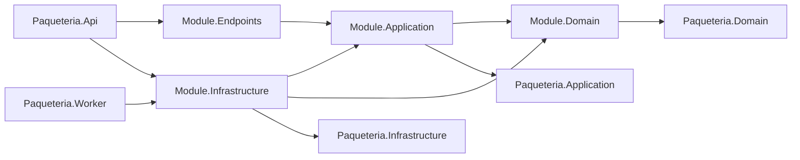

# Arquitectura de módulos

Paquetenvia se implementa como un monolito modular. Cada módulo mantiene sus
tipos y decisiones internas aislados, comparte solamente building blocks
deliberados y se integra con los ejecutables desde los composition roots. La
plantilla y las pruebas descritas aquí son la implementación de ARC-001; no
agregan lógica de negocio.

## Forma canónica

Cada módulo tiene exactamente cuatro proyectos:

| Capa | Responsabilidad | Referencias directas permitidas |
| --- | --- | --- |
| `Domain` | Modelo y reglas de dominio puras | `Paqueteria.Domain` |
| `Application` | Casos de uso y puertos | su `Domain`, `Paqueteria.Application` |
| `Infrastructure` | Adaptadores técnicos | su `Application`, su `Domain`, `Paqueteria.Infrastructure` |
| `Endpoints` | Transporte HTTP o tiempo real | su `Application`, `Microsoft.AspNetCore.App` |

`Paqueteria.Api` y `Paqueteria.Worker` son los únicos composition roots. Sus
referencias a módulos están enumeradas de forma explícita en el catálogo de
pruebas; no convierten a los módulos en dependencias entre sí.



No se permiten referencias a infraestructura o frameworks desde `Domain`, ni
referencias a infraestructura desde `Application`. Un módulo tampoco puede
referenciar proyectos, ensamblados o internals de otro módulo. En particular,
no se comparte acceso a datos, repositorios concretos, proveedores, controllers
o hubs entre módulos.

## Generar un módulo

Instala la plantilla desde la raíz del repositorio:

```powershell
dotnet new install .\templates\Paqueteria.Module --force
```

Genera el módulo y agrégalo a la solución:

```powershell
$ModuleName = "Example"
dotnet new paquetenvia-module --name $ModuleName --output ".\src\Modules\$ModuleName"
dotnet sln .\Paqueteria.sln add ".\src\Modules\$ModuleName\$ModuleName.Domain\$ModuleName.Domain.csproj" ".\src\Modules\$ModuleName\$ModuleName.Application\$ModuleName.Application.csproj" ".\src\Modules\$ModuleName\$ModuleName.Infrastructure\$ModuleName.Infrastructure.csproj" ".\src\Modules\$ModuleName\$ModuleName.Endpoints\$ModuleName.Endpoints.csproj"
```

Después registra sus cuatro ensamblados y el mapa permitido en
`tests/Paqueteria.ArchitectureTests/Architecture/SolutionCatalog.cs`. Agrega al
API el proyecto `Endpoints` y, cuando corresponda, `Infrastructure`; agrega al
Worker solamente `Infrastructure`. Esas referencias deben quedar reflejadas en
el mismo catálogo.

La opción `--BuildingBlocksPath` existe para pruebas o consumidores fuera de
`src/Modules`; dentro del repositorio se usa su valor predeterminado.

## Validación

Ejecuta toda la suite:

```powershell
dotnet test .\Paqueteria.sln --no-build
```

Para ejecutar solo las reglas arquitectónicas y el smoke test de plantilla:

```powershell
dotnet test .\tests\Paqueteria.ArchitectureTests\Paqueteria.ArchitectureTests.csproj
```

El smoke test instala la plantilla en un `DOTNET_CLI_HOME` aislado, genera un
módulo llamado `Sandbox` en el directorio temporal del sistema, crea una
solución y lo compila. El directorio temporal se valida antes de eliminarse; no
se genera `Sandbox` dentro del repositorio.

Las pruebas verifican:

- cobertura completa y sin duplicados del catálogo de proyectos productivos;
- las cuatro capas exactas de cada módulo;
- referencias de proyecto y referencias emitidas por los ensamblados;
- ausencia de frameworks, proveedores y adaptadores en `Domain` y `Application`;
- aislamiento entre módulos e `InternalsVisibleTo` extranjeros;
- ciclos, con la cadena completa en el diagnóstico;
- ubicación de controllers y hubs, y ausencia de tipos de dominio en su contrato;
- que API y Worker sean los únicos composition roots;
- fixtures negativas que prueban que las reglas realmente fallan.

Un error `expected [...], actual [...]` indica que el `.csproj` y el mapa
explícito difieren. Un error `Dependency cycle` muestra la cadena que debe
romperse. Las violaciones `A -> B` identifican directamente la dependencia
prohibida.

## Revisión humana y excepciones

Las pruebas impiden que controllers y hubs vivan fuera de la capa de transporte
o expongan objetos de dominio. La revisión humana debe confirmar además que sus
métodos solo adapten transporte y deleguen a `Application`, sin decisiones de
negocio, consultas directas, persistencia ni coordinación entre módulos.

Una excepción arquitectónica requiere un ADR nuevo aceptado antes de cambiar el
catálogo o las reglas. Los ADR congelados en `docs/normative/v0.6/` no se editan.

Para revertir un módulo recién generado, elimina únicamente sus cuatro proyectos
de la solución, sus entradas del catálogo y su directorio, y revierte las
referencias agregadas a API o Worker. No borres building blocks ni modifiques el
baseline normativo.
