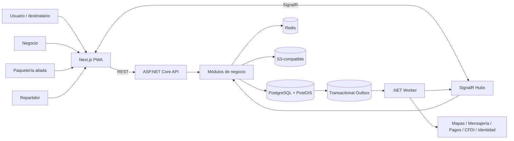

# Arquitectura técnica normativa

**Versión:** 0.6 — .NET, Next.js, SignalR, RLS y runtime hardening  
**Estado:** APROBADA para MVP-0 a MVP-3; evolución V1 sujeta a métricas y ADR  
**Autoridad:** este documento prevalece sobre ejemplos no normativos. Las decisiones de proveedores continúan sujetas a `AI-10_DECISIONS_AND_GATES.yaml`.

## 1. Objetivos arquitectónicos

La arquitectura debe permitir lanzar rápido en Culiacán, mantener consistencia transaccional y crecer durante el corto y mediano plazo sin reescribir el núcleo del producto. Sus objetivos son:

1. preservar reglas de negocio, custodia, tarifas y aislamiento multiempresa;
2. escalar API, tiempo real y procesamiento asíncrono de forma independiente;
3. evitar microservicios prematuros y dependencias operativas innecesarias;
4. conservar contratos suficientemente estables para extraer componentes cuando las métricas lo justifiquen;
5. permitir varias organizaciones, aliados, zonas y ciudades sin mezclar datos;
6. operar con recuperación, auditoría, observabilidad e idempotencia desde el MVP;
7. mantener proveedores externos detrás de puertos para poder sustituirlos.

## 2. Estilo arquitectónico aprobado

### 2.1 Monolito modular

El backend es un **monolito modular en .NET**. Los dominios viven en la misma solución y, durante MVP-0 a MVP-3, se despliegan principalmente dentro de `Paqueteria.Api` y `Paqueteria.Worker`. Esto no autoriza acoplamiento entre módulos.

Cada módulo controla:

- entidades y objetos de valor;
- reglas y máquina de estados;
- casos de uso;
- tablas/esquema lógico;
- contratos publicados;
- endpoints y políticas de autorización;
- eventos de dominio/integración;
- pruebas.

Un módulo no puede modificar directamente tablas, entidades o repositorios internos de otro módulo. La colaboración se realiza mediante comandos, consultas, interfaces publicadas, read models o eventos.

### 2.2 Clean Architecture por módulo

Cada módulo se organiza en capas:

```text
Module.Domain
      ↑
Module.Application
      ↑
Module.Infrastructure
      ↑
API / Worker composition
```

- **Domain:** reglas puras, aggregates, value objects, políticas y eventos. No referencia ASP.NET Core, EF Core, SignalR, Redis ni SDK externos.
- **Application:** comandos, consultas, handlers, validación, autorización contextual, puertos y coordinación transaccional.
- **Infrastructure:** EF Core, PostgreSQL/PostGIS, Redis, almacenamiento, adaptadores externos y repositorios.
- **Presentation/composition:** controllers, OpenAPI, hubs, jobs y registro de dependencias. No contiene reglas de negocio.

## 3. Vista de contexto



REST y PostgreSQL son la autoridad para comandos y estado persistente. SignalR distribuye proyecciones de eventos confirmados; no sustituye la API ni conserva estado de negocio.

## 4. Stack normativo

| Capa | Decisión |
|---|---|
| Runtime backend | .NET 10 LTS |
| Lenguaje | C#, nullable habilitado, analyzers como errores en CI |
| API | ASP.NET Core Web API con controllers y OpenAPI 3.1 |
| Tiempo real | ASP.NET Core SignalR con hubs fuertemente tipados |
| Frontend | Next.js + React + TypeScript estricto, PWA móvil primero |
| ORM | Entity Framework Core + Npgsql |
| Geoespacial | PostgreSQL + PostGIS + NetTopologySuite |
| Caché/coordinación | Redis |
| Procesos asíncronos | .NET Worker Service + transactional outbox |
| Jobs programados | `IJobScheduler`; implementación aprobada por ADR |
| Archivos | S3-compatible; MinIO local |
| Identidad | OIDC/OAuth 2.1 mediante `IIdentityProvider` |
| Observabilidad | OpenTelemetry, logs JSON, métricas y trazas |
| Pruebas | xUnit, WebApplicationFactory, Testcontainers, Playwright |
| Entorno local | Docker Compose |
| Despliegue | Contenedores; infraestructura administrada cuando sea posible |

## 5. Componentes desplegables

### 5.1 `apps/web`

Next.js PWA para administradores, operaciones, negocios, aliados, repartidores y tracking público. Consume solamente contratos REST/SignalR publicados. Nunca accede directamente a la base de datos.

### 5.2 `Paqueteria.Api`

Responsabilidades:

- REST `/api/v1`;
- autenticación y autorización;
- resolución de tenant;
- idempotencia;
- Problem Details;
- OpenAPI;
- endpoints de carga firmada;
- hubs SignalR;
- health/readiness checks;
- composición de módulos.

Debe ser **stateless**: no guarda sesiones, archivos, locks, progreso de jobs ni estado requerido para atender una petición futura en memoria local.

### 5.3 `Paqueteria.Worker`

Hospeda consumidores independientes para:

- outbox;
- publicación SignalR;
- notificaciones;
- validación/procesamiento de archivos;
- reportes y exportaciones;
- rutas programadas;
- conciliaciones y liquidaciones;
- tareas de retención y mantenimiento.

Los consumers son idempotentes, cancelables, tenant-aware y observables. Inicialmente comparten un ejecutable, pero pueden desplegarse con perfiles o extraerse por carga.

### 5.4 Infraestructura

- PostgreSQL/PostGIS: fuente de verdad transaccional.
- Redis: caché, rate limits, locks, idempotency cache y scale-out; nunca estado oficial de órdenes.
- Object storage: POD, firmas, comprobantes y exportaciones.
- CDN/WAF/gateway: introducido según fase de despliegue.

## 6. Estructura de repositorio

```text
/Paqueteria.sln
/apps
  /web
/src
  /Paqueteria.Api
  /Paqueteria.Worker
  /BuildingBlocks
    /Paqueteria.Domain
    /Paqueteria.Application
    /Paqueteria.Infrastructure
    /Paqueteria.Contracts
  /Modules
    /Identity
    /Organizations
    /Clients
    /Locations
    /Pricing
    /Orders
    /Dispatch
    /Drivers
    /Routes
    /Custody
    /Incidents
    /Finance
    /Allies
    /Notifications
    /Reporting
/tests
  /ArchitectureTests
  /UnitTests
  /IntegrationTests
  /ContractTests
  /EndToEndTests
/contracts
  /openapi
  /signalr
/database
  /migrations
  /seeds
  /policies
/docs
  /adr
  /runbooks
  /api
```

`ArchitectureTests` debe impedir referencias inversas, acceso a infraestructura de otro módulo, controllers con lógica de dominio y uso directo de SDK externos desde Domain/Application.

## 7. Límites y dependencias

```text
Domain -> BCL y BuildingBlocks.Domain mínimos
Application -> Domain + Contracts
Infrastructure -> Application + Domain
Api/Worker -> composition roots
Web -> contratos generados
```

Reglas:

1. no referencias circulares;
2. building blocks pequeños, estables y sin convertirse en “módulo común” de negocio;
3. no repositorio genérico universal;
4. no mediator/bus interno obligatorio sin ADR;
5. no acceso cross-module a `DbSet` o tablas privadas;
6. los contratos públicos se versionan y mantienen compatibilidad durante una release.

## 8. Módulos y propiedad de datos

| Módulo | Responsabilidad principal |
|---|---|
| Identity | usuarios, sesiones, roles y claims externos |
| Organizations | tenants, membresías, branding y relaciones |
| Clients | clientes comerciales y destinatarios autorizados |
| Locations | direcciones, zonas, ciudades y geocercas |
| Pricing | reglas, cotizaciones, overrides y snapshots |
| Orders | orden, paquetes, timeline y máquina de estados |
| Dispatch | asignaciones, ofertas y decisiones de despacho |
| Drivers | perfiles, documentos, capacidad y disponibilidad |
| Routes | rutas, paradas, secuencia y ejecución |
| Custody | POD, transferencias de custodia y evidencias |
| Incidents | intentos fallidos, reclamaciones y resoluciones |
| Finance | costos, ingresos, COD, liquidaciones y conciliación |
| Allies | modalidades, no captación, respaldo y capacidad compartida |
| Notifications | plantillas, intentos, entrega y proveedores |
| Reporting | read models, exportaciones y métricas operativas |

La base física puede ser única, pero cada módulo usa un esquema lógico y mappings propios. Los flujos críticos que deban ser atómicos comparten una transacción PostgreSQL explícita; cualquier efecto externo sale por outbox.

## 9. Datos y persistencia

### 9.1 PostgreSQL/PostGIS

Normas:

- claves UUID/ULID no enumerables según contrato;
- fechas en UTC;
- dinero en centavos/value objects, nunca `double`;
- optimistic concurrency en aggregates críticos;
- append-only para eventos y auditoría;
- índices compuestos por tenant, estado y fecha;
- geometrías con SRID documentado;
- migraciones expand/contract para cambios compatibles;
- migraciones ejecutadas por pipeline controlado, nunca automáticamente en producción.

### 9.2 Multi-tenancy

- `owner_org_id` identifica al dueño comercial del cliente/orden.
- `operator_org_id` identifica quién ejecuta físicamente el servicio.
- `city_id`, `service_area_id` y `operating_zone_id` preparan expansión geográfica.
- RLS es la barrera final.
- `ITenantContext` se resuelve antes del caso de uso.
- filtros EF son defensa adicional.
- jobs y eventos incluyen tenant y actor/sistema.
- almacenamiento, caché y grupos SignalR incorporan tenant o sujeto autorizado.

### 9.3 Read models

Dashboards y tracking pueden usar proyecciones/read models, pero el estado oficial permanece en aggregates y eventos persistidos. Reportes pesados se generan asíncronamente y se cachean.

## 10. Flujo de comandos y consultas

### Comando

```text
Web -> REST -> Auth/Tenant -> Application handler -> Domain -> Transaction
     -> aggregate + audit + outbox -> commit -> response
```

### Evento externo

```text
Outbox -> Worker -> adapter / SignalR -> delivery log -> retry/dead-letter policy
```

### Consulta

```text
Web -> REST -> authorization -> query/read model -> DTO
```

Los commands aceptan `Idempotency-Key` cuando crean dinero, custodia, orden, POD, aceptación de oferta o liquidación.

## 11. Transactional Outbox

Todo cambio que requiera notificación, integración o proyección externa registra el evento en la misma transacción que el aggregate y auditoría. El Worker:

1. reclama mensajes con locking seguro;
2. publica usando un identificador estable;
3. registra intento y resultado;
4. reintenta con backoff;
5. mueve mensajes irrecuperables a estado de revisión;
6. mantiene métricas de atraso y edad del mensaje más antiguo.

No se permite publicar SignalR o llamar proveedores antes del commit.

## 12. SignalR

### 12.1 Hubs

- `/hubs/operations`: operadores y aliados autorizados.
- `/hubs/driver`: repartidores autenticados.
- `/hubs/tracking`: tracking público limitado por token.

### 12.2 Grupos

Asignados exclusivamente por el servidor:

```text
org:{organizationId}
driver:{driverId}
order:{orderId}
route:{routeId}
assignment:{assignmentId}
tracking:{publicOrderId}
```

### 12.3 Consistencia

Cada evento incluye `event_id`, `aggregate_id`, `aggregate_version`, `occurred_at`, `audience` y `schema_version`. El cliente deduplica, reconecta y resincroniza por REST con cursor/version. Los hubs no ejecutan reglas de dominio.

### 12.4 Scale-out

- una API: administración local de conexiones;
- más de una API: Redis backplane o servicio administrado aprobado;
- Data Protection keys y secretos compartidos;
- no depender de sticky sessions como solución arquitectónica;
- medir conexiones, fan-out, latencia y reconexiones.

## 13. Redis

Usos permitidos:

- caché reconstruible;
- rate limiting;
- locks distribuidos;
- coordinación de aceptación de ofertas;
- idempotency responses temporales;
- backplane SignalR;
- datos de presencia/última actividad no autoritativos.

Usos prohibidos:

- estado oficial de órdenes;
- única copia de tarifas, POD, pagos o liquidaciones;
- colas sin persistencia/recuperación aprobada;
- almacenamiento permanente de ubicación histórica.

## 14. Archivos y evidencias

Los binarios se guardan en almacenamiento S3-compatible. PostgreSQL conserva metadata, hash, tenant, retención y relación. El flujo es:

1. solicitar URL firmada;
2. cargar a cuarentena;
3. validar extensión, MIME, tamaño y hash;
4. escanear cuando el proveedor esté disponible;
5. promover a almacenamiento definitivo;
6. crear POD en transacción;
7. descargar mediante URL firmada corta.

No usar disco local persistente de API/Worker.

## 15. Integraciones por puertos

Interfaces mínimas:

- `IIdentityProvider`
- `IGeocodingProvider`
- `IRoutingProvider`
- `IMessagingProvider`
- `IPaymentProvider`
- `IInvoiceProvider`
- `IObjectStorageProvider`
- `IRealtimePublisher`
- `IJobScheduler`
- `IEventBus` reservado para una extracción futura; no se implementa como broker productivo durante MVP sin ADR.

Cada puerto tiene fake determinista y contract tests. Domain/Application no referencia SDK de proveedor.

## 16. Resiliencia

- timeouts explícitos por proveedor;
- retries solo en operaciones idempotentes;
- circuit breaker para proveedores degradados;
- bulkheads o límites de concurrencia en integraciones;
- cancellation tokens en toda I/O;
- compensaciones explícitas, no transacciones distribuidas;
- feature flags para activar proveedores y funciones por tenant;
- degradación controlada: tracking/operación principal no debe caer por fallo de notificaciones.

## 17. Seguridad

- OIDC y MFA para roles privilegiados;
- autorización por política y recurso;
- RLS y pruebas cross-tenant;
- CORS cerrado;
- rate limits por IP, usuario, tenant y endpoint/hub;
- secretos en secret manager;
- cifrado en tránsito y reposo;
- redacción de PII, tokens y ubicación en logs;
- subida de archivos restringida;
- auditoría append-only;
- tokens públicos de tracking cortos, rotables y con mínimo alcance;
- escaneo de dependencias y contenedores en CI.

## 18. Observabilidad y SLO

Toda petición/job/evento debe llevar `trace_id`, `correlation_id`, tenant y actor técnico redactado. Métricas mínimas:

- latencia p50/p95/p99 y errores HTTP;
- conexiones y latencia SignalR;
- edad y tamaño de outbox/colas;
- duración y fallos de jobs;
- consultas PostgreSQL lentas, CPU, conexiones y locks;
- cache hit/miss y locks Redis;
- tiempo/fallo de proveedores;
- ordenes por minuto, transiciones y POD;
- intentos fallidos y conciliaciones.

Las señales y umbrales de escalamiento están en `AI-15_SCALABILITY_CONTRACT.yaml`.

## 19. Pruebas

Obligatorias:

- unitarias Domain/Application;
- integración real con PostgreSQL/PostGIS, Redis y MinIO mediante Testcontainers;
- arquitectura/límites modulares;
- RLS y autorización cross-tenant;
- idempotencia y concurrencia;
- contratos OpenAPI/SignalR;
- reconexión y resincronización;
- outbox con reintentos/duplicados;
- backups/restauración;
- pruebas de carga antes de cada cambio de fase;
- Playwright para flujos PWA y tiempo real.

## 20. Despliegue y escalamiento progresivo

La unidad inicial es:

```text
Next.js + API + Worker + PostgreSQL/PostGIS + Redis + Object Storage
```

API y Worker escalan horizontalmente por separado. Las fases, topologías, métricas y candidatos a extracción se definen en `AI-15_SCALABILITY_CONTRACT.yaml`.

No comenzar con Kubernetes. Preferir servicios de contenedores administrados, base administrada, Redis administrado y object storage. Kubernetes solo se evalúa cuando exista una necesidad demostrada de plataforma, multi-región o gran cantidad de componentes.

## 21. Estrategia para varias ciudades

Desde el primer esquema:

- configuración por ciudad y zona;
- tarifas, horarios, SLA y límites por service area;
- timezone en bordes y UTC interno;
- repartidores y aliados asociados a zonas autorizadas;
- reportes segmentados por ciudad;
- ninguna regla hardcodeada exclusivamente a Culiacán, salvo configuración seed.

Expandir a otra ciudad requiere gate operativo/legal/comercial y pruebas de aislamiento geográfico, no una bifurcación del código.

## 22. Extracción futura de servicios

Un módulo se extrae solamente si cumple varios criterios:

1. necesita escalar de forma sostenida y diferente;
2. genera fallas que deben aislarse;
3. requiere despliegue independiente frecuente;
4. posee contrato estable y propiedad clara de datos;
5. la complejidad operativa adicional está justificada;
6. existen métricas y equipo para operarlo.

Orden probable de candidatos:

1. Notifications;
2. tracking/ubicaciones de alta frecuencia;
3. file processing;
4. reporting/analytics;
5. routing/optimización;
6. Finance solo si conciliación y cumplimiento lo exigen.

Orders y Dispatch permanecen juntos mientras constituyan el núcleo transaccional y su separación no aporte un beneficio probado.

## 23. Anti-patrones prohibidos

- microservicios por módulo desde el inicio;
- lógica de negocio en controllers, hubs o EF entities;
- compartir tablas sin dueño;
- usar SignalR como canal de comandos autoritativo;
- guardar archivos en disco local;
- mantener sesiones/locks críticos en memoria de una instancia;
- consultas analíticas pesadas en rutas sincrónicas;
- despliegues que ejecuten migraciones destructivas sin expand/contract;
- seleccionar proveedores reales sin gate;
- optimización prematura sin medición.

## 24. Decisiones arquitectónicas

Las decisiones aprobadas están registradas en `docs/adr/`. Cualquier desviación requiere un ADR nuevo con contexto, alternativas, consecuencias, plan de migración y aprobación correspondiente.


## 24. Endurecimiento contractual v0.5

### 24.1 Cotización y creación de orden

La cotización persiste referencias normalizadas de origen/destino, servicio, ruta consolidada y snapshots de paquetes/entrada. `CreateOrder` copia estos datos desde una cotización vigente; no acepta reconstrucción desde `breakdown` ni sustitución silenciosa de ubicaciones.

### 24.2 Identidad y membresías

`User` es identidad global. `OrganizationMembership` asigna rol y estado por organización. Cada petición privada establece un único contexto activo autorizado, aunque el token pueda listar varias membresías.

### 24.3 Roles de PostgreSQL y RLS

El rol de aplicación y el Worker no pueden ser dueños de tablas ni tener `BYPASSRLS`. El rol de migraciones posee objetos. Las tablas de alto volumen denormalizan `owner_org_id`/`operator_org_id` para políticas e índices directos; el acceso cross-tenant se limita a funciones de roles `NOLOGIN` dedicados.

### 24.4 Ubicación del repartidor

La ubicación entra por REST, se deduplica por `client_event_id`, se persiste en `driver_positions` y solo después se distribuye mediante outbox/SignalR. Los hubs no reciben comandos autoritativos y el tracking público no expone coordenadas exactas en MVP.

### 24.5 Custodia y privacidad

Los eventos/POD siguen append-only. Las solicitudes ARCO se resuelven mediante política aprobada de retención, restricción de acceso, pseudonimización o borrado criptográfico cuando proceda, sin reescribir silenciosamente la cadena de custodia.


## 25. Endurecimiento arquitectónico normativo v0.5

### 25.1 Esquemas físicos

La base usa un esquema por módulo: `identity`, `organizations`, `clients`, `locations`, `pricing`, `orders`, `dispatch`, `drivers`, `routes`, `custody`, `incidents`, `finance`, `allies`, `notifications` y `reporting`. `platform` contiene outbox, auditoría e idempotencia; `security` contiene funciones de acceso controlado; `extensions` se reserva para extensiones relocatables como `pgcrypto`. Las FKs cross-schema son válidas solo cuando aparecen en la matriz de dependencias y los ArchitectureTests inspeccionan tanto referencias .NET como el catálogo PostgreSQL.

### 25.2 Roles, bootstrap y RLS

API y Worker usan roles `NOBYPASSRLS` que no poseen objetos. El rol `paqueteria_bootstrap NOLOGIN BYPASSRLS` es propietario exclusivamente de `resolve_identity_context` y `get_public_tracking_projection`, con SELECT por columna, `search_path` fijo y `EXECUTE` revocado a PUBLIC. El rol `paqueteria_outbox_executor NOLOGIN BYPASSRLS` es propietario únicamente de las funciones de claim cross-tenant. Ninguna credencial runtime puede `SET ROLE` a roles privilegiados.

### 25.3 Contexto tenant y pooling

Cada unidad de trabajo abre una transacción y ejecuta `set_config('app.current_user_id', ..., true)` y `set_config('app.current_org_ids', ..., true)` antes de cualquier consulta. La implementación recomendada es el coordinador transaccional o `IDbTransactionInterceptor.TransactionStartedAsync`; no `DbConnectionInterceptor`. `EnableRetryOnFailure` debe envolver la unidad completa y reaplicar el contexto en cada intento. Las consultas fuera de transacción fallan cerradas. Antes de PgBouncer se ejecuta una prueba real de transaction pooling.

### 25.4 Mutabilidad

`orders.order_events`, `custody.proofs` y `platform.audit_logs` rechazan UPDATE/DELETE para roles runtime. `platform.outbox_events` y `platform.location_outbox_events` conservan inmutables topic, payload, aggregate y tenant; el Worker solo cambia estado, lease, reintentos, error y timestamps operativos.

### 25.5 Evidencia

El flujo único es: crear `proof_upload_session`, obtener URL firmada, cargar a cuarentena, validar hash/tipo/tamaño/malware, promover objeto y finalizar POD por JSON. La API no procesa multipart ni guarda archivos en disco local. La sesión es mutable; el Proof definitivo es append-only.

### 25.6 Telemetría

La PWA envía lotes de 1–20 posiciones. Todas las posiciones válidas se persisten; solo puntos significativos o la última posición de una ventana generan `location_outbox_events`. Este lane tiene claim, consumer, métricas, retención y particionamiento independientes para no retrasar eventos de custodia, dinero u órdenes.

### 25.7 Visibilidad HTTP

401 indica autenticación ausente/inválida. 403 indica capacidad insuficiente dentro de un recurso visible del tenant. 404 se usa para recurso inexistente, cross-tenant o token público inválido/expirado/revocado, con cuerpo indistinguible.

### 25.8 Precio, COD y ciclo de vida

`Pricing.Domain` determina `pricing_tier` y `minimum_total_cents_snapshot`; SQL comprueba coherencia. Una cotización crea como máximo una orden. Si existe COD, la entrega requiere registro y el cierre conciliación. `CLOSED` admite reclamaciones hasta `claim_window_ends_at`; después un job idempotente fija `finalized_at`.

### 25.9 Coordinación cross-module

Solo cinco flujos pueden compartir transacción cross-module: quote→order, assignment→order event, proof/custody→transition, COD reconciliation→close y offer acceptance→assignment. Una prueba de arquitectura usa lista blanca y falla ante cualquier flujo adicional.


## 26. Endurecimiento normativo v0.6

### 26.1 Extensiones y criptografía

`pgcrypto` se instala en el esquema técnico `extensions` y toda llamada se califica (`extensions.digest`). El token de tracking se genera en C# con 32 bytes criptográficamente aleatorios, se codifica Base64URL sin padding y se hashea con SHA-256 sobre los bytes UTF-8 exactos de la cadena codificada. SQL verifica con `extensions.digest(pg_catalog.convert_to(token,'UTF8'),'sha256')`. El hash se almacena como `bytea` de 32 bytes.

PostGIS permanece en `public`. Los roles runtime reciben `USAGE` pero nunca `CREATE` sobre `public`; mover PostGIS requiere ADR por su impacto en tipos, operadores, Npgsql y actualizaciones.

### 26.2 Ciclo de vida del outbox con lease

Los dos lanes (`outbox_events` y `location_outbox_events`) usan `lease_token` y `lease_expires_at`.

- `claim_*` asigna un lease nuevo y cambia a `PROCESSING`.
- `settle_*` solo modifica la fila si `id`, estado `PROCESSING`, lease vigente y token coinciden.
- `requeue_stale_*` recupera leases vencidos en lotes y envía mensajes venenosos a `DEAD`.
- `purge_*` elimina únicamente `PROCESSED`/`DEAD` antiguos y pertenece al rol de mantenimiento.

`paqueteria_app` y `paqueteria_worker` no tienen `SELECT`, `UPDATE` ni `DELETE` directo sobre los lanes. Los productores autorizados pueden `INSERT`, pero proporcionan todos los valores: UUID, timestamps, estado `PENDING`, intentos, prioridad y disponibilidad. Los mappings EF usan `ValueGeneratedNever`; el SQL emitido no contiene `RETURNING`.

### 26.3 Tracking público minimizado

El mapa de los 17 estados internos al vocabulario público vive en `AI-04`. SQL y C# lo implementan y una prueba de contrato compara ambos.

- En C#, un estado no mapeado lanza `PublicStatusMappingException`, impide publicar SignalR y genera alerta.
- En SQL, un estado no mapeado produce proyección nula; el borde anónimo responde 404 uniforme.
- `order_events` es privado por defecto. Solo se expone `public_event_code` no nulo y nunca el payload interno.

### 26.4 Evidencia legal de aceptación

`orders.order_acceptances` es RLS y append-only. Se inserta en la transacción `quote_snapshot_to_order` junto con consumo de cotización, orden, primer evento y outbox.

`OrderAcceptanceCanonicalForm v1` es JSON compacto de esquema fijo, no serialización automática ni JCS genérico. Usa UTF-8 sin BOM, UUID `D` minúscula, timestamp UTC con siete fracciones y canal en mayúsculas. Se conserva SHA-256 y vectores permanentes.

### 26.5 Provisioning bajo RLS

El rol bootstrap nunca escribe. La aplicación genera los UUID nuevos y, dentro de la transacción de provisioning, configura temporalmente `current_user_id/current_org_ids` para autorizar esos identificadores antes de insertar. Usuario, organización, membresía inicial y auditoría deben ser atómicos y el `identity_subject` debe coincidir con el principal OIDC validado.

### 26.6 Contexto tenant parametrizado

`app.current_org_ids` se produce con parámetro Npgsql `uuid[]`, se convierte a texto PostgreSQL dentro de `set_config`, usa `{}` como vacío y nunca `NULL`. El contexto se reaplica en cada transacción y retry.

### 26.7 Dinero

Todo valor monetario usa `long` en C#, `bigint` en PostgreSQL e `integer/int64` en OpenAPI. Se prohíben `float`, `double` y decimal fraccional para centavos persistidos.

### 26.8 Retención de telemetría

`location_outbox_events.driver_position_id` conserva `UNIQUE` sin FK. Esto desacopla retención de posiciones y lane, pero antes de particionar el lane debe aprobarse una estrategia de unicidad global compatible con la clave de partición.
